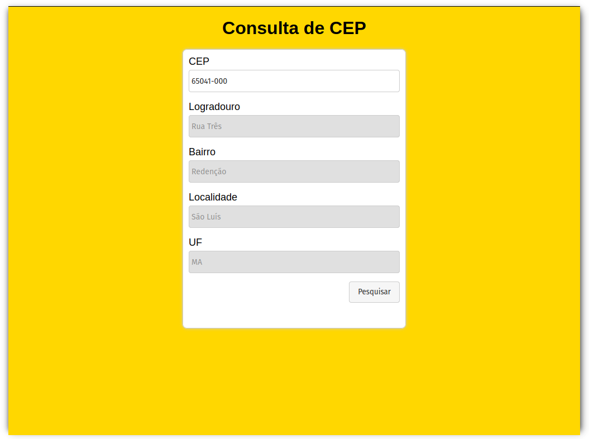

<h1 align="center">CONSULTA DE CEP</h1>

## Sobre

Nessa pequena aplicação, você podá realizar pesquisas simples de CEP e obter infomações como, nome da cidade, logradouro e o bairro. Ideal pra quando você tem o CEP do endereço e não sabe as demais informações.

## Objetivo

O objetivo desse projeto, primeiramente é mostrar como é realizado uma consulta a uma API através do Fetch API. Fetch API é uma das melhores tecnologias para processamento assíncrono, trabalhando com Promises permite tratar se o resultado deu certo ou não.

## Site

Caso queira ver o resultado do site, acesse: [Consulta de CEP](https://benmacario.github.io/consulta-api-viacep/).

## LICENÇA

[MIT License](LICENSE)
